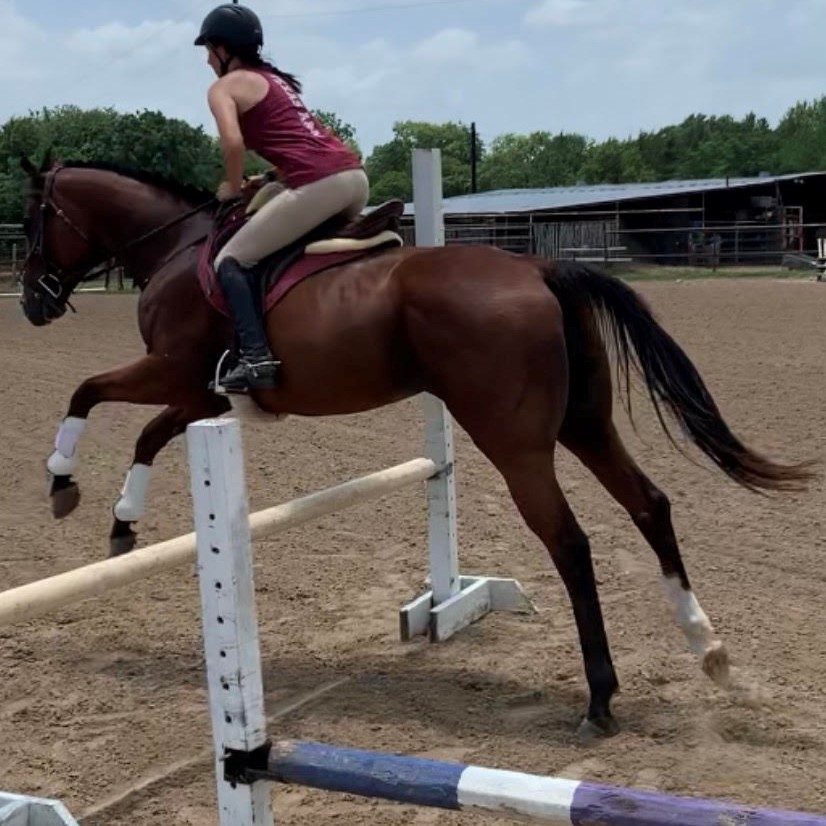

Howdy!

My name is Ashlynn Helm and I am a senior technology management major, business minor. I call my hometown College Station, Texas, but I've lived in College Station, Riesel, Livingston, Point Blank, Bryan, and Rockdale. All towns have been in Central or East Texas, so I'm Texas born and raised.

I'm also a third generation Aggie. My mother's dad was class of 1971, my mom was class of 2003, and I am class of 2021. My mom's brother also graduated from TAMU, and my younger cousin is currently attending TAMU in Corpus Christi, Texas. My younger sister is planning to come to the Mays Business school in the fall, and my younger brother is lightly considering TAMU.

Some fun facts about me: I own an ex-racehorse named Wes, and have retrained him to be a jumper. He is pictured below over our first 2'6" jump. I also have a shelter rescue from Madisonville, Texas named Gunnar. Gunnar is a Husky/Lab mix.

